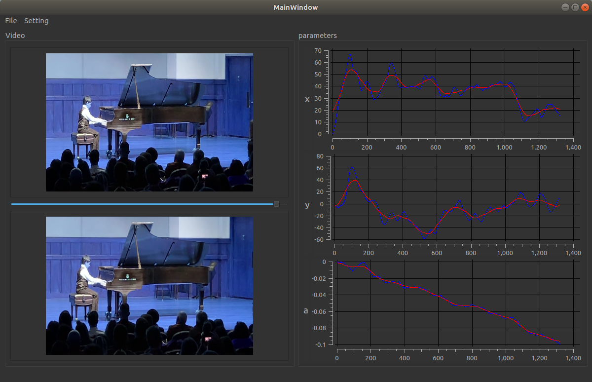

# Video Stabilization using OpenCV

I mainly referenced  the following links, and made a simple user interface using Qt.
- https://www.mathworks.com/help/vision/examples/video-stabilization-using-point-feature-matching.html
- http://nghiaho.com/?p=2093
- https://abhitronix.github.io/2018/11/30/humanoid-AEAM-3/

This is a screenshot:

